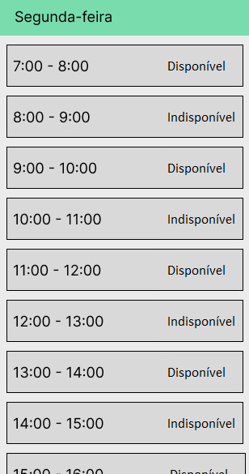

# Projeto de Engenharia de Software

Esse projeto está sendo realizado porque no ifs possui certo problemas um deles seria que muitas vezes quando se chega no ginásio do ifs ele está sendo usado, está em reforma, está sendo limpado, ninguém sabe com quem está a chave ou aquele horário não está disponível para uso.

Esse é um projeto desenvolvido pelos alunos Michael Wesley Carvalho Dos Santos , Genisson De Jesus Santos , Ronald Ruan Santos Ferraz e Carlos Eduardo Santana Santos, do curso de Sistemas de informação do IFS campos Lagarto, referente a disciplina de Engenharia de Software do professor Flaygner Matos Reboucas.

Este é o [link do projeto](https://www.figma.com/community/file/1118616456505223758).

## Justificativa

A justificativa nesse projeto tem o intuito de criar um software necessário para realizar um controle e previsão das atividades realizadas no ginásio.

## Objetivo

O objetivo seria organizar os horários de utilização do ginásio, organizar seus horários de limpeza podendo ser feita por aqueles que a estão utilizando, reservar o ginásio para um horário específico e ter um acesso fácil as chaves dele.

## Visão geral da proposta 

Então queremos um software que realize as reservas do ginásio como base, seus horários de limpeza, horários de utilização dos professores e suas manutenções periódicas. 

## Os Stakeholders

Os Stakeholders seriam os alunos do ifs, os professores, os funcionários do setor de limpeza, coordenação do ginásio, zeladores do ginásio e funcionários da manutenção.

## Lista de requisitos do software

### Não Funcionais

- Funcionar nas plataformas Android, IOS e Desktop
- Permitir integração com os sistemas já implementados no IFS Lagarto

### Funcionais

- Realizar login pelo aplicativo do ifs
- Informar reserva 
- Reservar dia na semana
- Finalizar o revezamento
- Exibir para os usuários os horários agendados
- Apresentar Calendário dos Dias agendados
- Sinalizar horário como disponível ou indisponível
- Registrar que um usuário pegou as chaves
- Registrar que um usuário devolveu as chaves

## Screenshots

